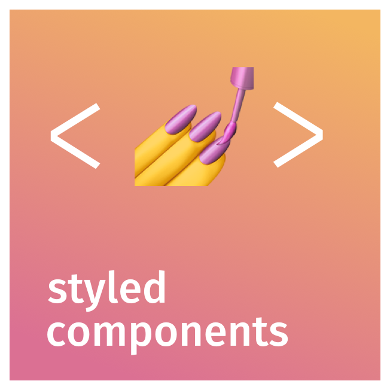

 
 

<h3>👋 Hi, I'm Atsuki! I’m a front-end developer with a real passion for building accessible, user-friendly applications. I'm always eager to learn more and stay curious, diving deep into new technologies and techniques to keep pushing the boundaries of what I can create. Let's explore and innovate together!</h3>
 
 

## Skills

### Languages

<!--
--><!--
--><!--
-->

### Frameworks, Libraries and Environments

<!--
--><!--
--><!--
--><!--
--><!--
--><!--
--><!--
--><!--
--><!--
-->

### CSS Frameworks and Preprocessors

<!--
--><!--
--><!--
--><!--
--><!--
-->

### Systems, CMss, and Database

<!--
--><!--
--><!--
--><!--
-->

### Development Tools and Environments

<!--
--><!--
--><!--
-->

 
 

## Projects

